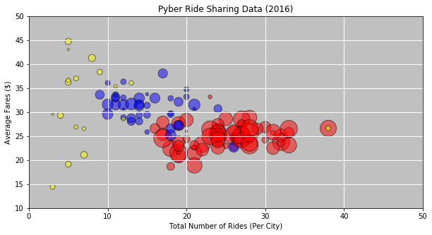
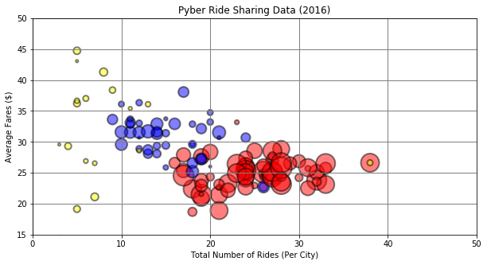
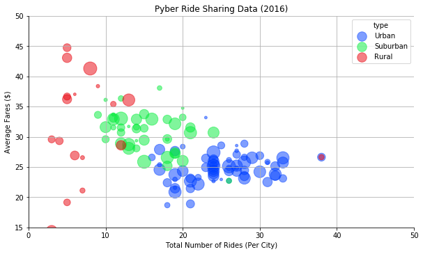
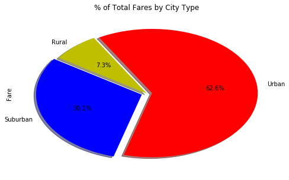
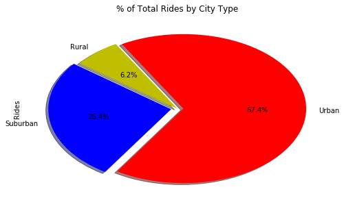
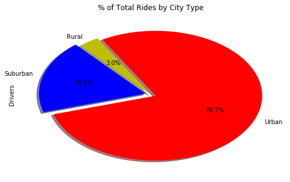

```python
# Dependencies
import csv
import pandas as pd
import random
import numpy as np
import string
import matplotlib.pyplot as plt
import seaborn as sns
```


```python
# Convert the city data into a DataFrame 
cities_pd = pd.read_csv('generated_data/city_data.csv')
cities_pd.head()
```


<div>
<style scoped>
    .dataframe tbody tr th:only-of-type {
        vertical-align: middle;
    }

    .dataframe tbody tr th {
        vertical-align: top;
    }

    .dataframe thead th {
        text-align: right;
    }
</style>
<table border="1" class="dataframe">
  <thead>
    <tr style="text-align: right;">
      <th></th>
      <th>city</th>
      <th>driver_count</th>
      <th>type</th>
    </tr>
  </thead>
  <tbody>
    <tr>
      <th>0</th>
      <td>Kevinmouth</td>
      <td>12</td>
      <td>Urban</td>
    </tr>
    <tr>
      <th>1</th>
      <td>Butlerville</td>
      <td>72</td>
      <td>Urban</td>
    </tr>
    <tr>
      <th>2</th>
      <td>Lake Nicholaston</td>
      <td>3</td>
      <td>Urban</td>
    </tr>
    <tr>
      <th>3</th>
      <td>Port Luke</td>
      <td>61</td>
      <td>Urban</td>
    </tr>
    <tr>
      <th>4</th>
      <td>Alexborough</td>
      <td>38</td>
      <td>Urban</td>
    </tr>
  </tbody>
</table>
</div>


```python
# Export the ride data into a DataFrame 
rides_pd = pd.read_csv('generated_data/ride_data.csv')
rides_pd.head()
```


<div>
<style scoped>
    .dataframe tbody tr th:only-of-type {
        vertical-align: middle;
    }

    .dataframe tbody tr th {
        vertical-align: top;
    }

    .dataframe thead th {
        text-align: right;
    }
</style>
<table border="1" class="dataframe">
  <thead>
    <tr style="text-align: right;">
      <th></th>
      <th>city</th>
      <th>date</th>
      <th>fare</th>
      <th>ride_id</th>
    </tr>
  </thead>
  <tbody>
    <tr>
      <th>0</th>
      <td>Lake Kennethbury</td>
      <td>2017-07-02 18:47:52</td>
      <td>29.16</td>
      <td>3839980036030</td>
    </tr>
    <tr>
      <th>1</th>
      <td>North Ashley</td>
      <td>2017-02-08 09:21:51</td>
      <td>34.35</td>
      <td>9159575273980</td>
    </tr>
    <tr>
      <th>2</th>
      <td>Duranmouth</td>
      <td>2017-12-08 23:49:44</td>
      <td>32.99</td>
      <td>9798773796688</td>
    </tr>
    <tr>
      <th>3</th>
      <td>Ashleyside</td>
      <td>2017-07-16 16:29:00</td>
      <td>35.85</td>
      <td>7598913227711</td>
    </tr>
    <tr>
      <th>4</th>
      <td>South Breanna</td>
      <td>2017-03-13 21:06:25</td>
      <td>18.64</td>
      <td>4011192940940</td>
    </tr>
  </tbody>
</table>
</div>


```python
rides_pd.count()
```


    city       2375
    date       2375
    fare       2375
    ride_id    2375
    dtype: int64


```python
#avgfare = avgfare.reset_index(drop=True)

avgfare = pd.DataFrame(rides_pd.groupby(['city'])['fare'].mean())
avgfare = avgfare.rename(columns={"fare":"Average Fare"})
avgfare.reset_index(inplace=True)

totalfare = pd.DataFrame(rides_pd.groupby(['city'])['fare'].sum())
totalfare = totalfare.rename(columns={"fare":"Total Fare"})
totalfare.reset_index(inplace=True)

ridecount = pd.DataFrame(rides_pd.groupby(['city'])['ride_id'].count())
ridecount = ridecount.rename(columns={"ride_id":"Ride Count"})
ridecount.reset_index(inplace=True)

analysis_df = pd.merge(avgfare, ridecount, left_on='city', right_on='city', how='outer')
analysis_df = pd.merge(analysis_df, totalfare, left_on='city', right_on='city', how='outer')

analysis_df.head()
```


<div>
<style scoped>
    .dataframe tbody tr th:only-of-type {
        vertical-align: middle;
    }

    .dataframe tbody tr th {
        vertical-align: top;
    }

    .dataframe thead th {
        text-align: right;
    }
</style>
<table border="1" class="dataframe">
  <thead>
    <tr style="text-align: right;">
      <th></th>
      <th>city</th>
      <th>Average Fare</th>
      <th>Ride Count</th>
      <th>Total Fare</th>
    </tr>
  </thead>
  <tbody>
    <tr>
      <th>0</th>
      <td>Alexborough</td>
      <td>27.632632</td>
      <td>19</td>
      <td>525.02</td>
    </tr>
    <tr>
      <th>1</th>
      <td>Andrewsborough</td>
      <td>28.545556</td>
      <td>27</td>
      <td>770.73</td>
    </tr>
    <tr>
      <th>2</th>
      <td>Ashleyside</td>
      <td>26.589375</td>
      <td>16</td>
      <td>425.43</td>
    </tr>
    <tr>
      <th>3</th>
      <td>Bellfort</td>
      <td>25.346667</td>
      <td>24</td>
      <td>608.32</td>
    </tr>
    <tr>
      <th>4</th>
      <td>Bettychester</td>
      <td>44.750000</td>
      <td>5</td>
      <td>223.75</td>
    </tr>
  </tbody>
</table>
</div>


```python
new_df = pd.merge(cities_pd, analysis_df, left_on='city', right_on='city', how='outer')
new_df.head()
```


<div>
<style scoped>
    .dataframe tbody tr th:only-of-type {
        vertical-align: middle;
    }

    .dataframe tbody tr th {
        vertical-align: top;
    }

    .dataframe thead th {
        text-align: right;
    }
</style>
<table border="1" class="dataframe">
  <thead>
    <tr style="text-align: right;">
      <th></th>
      <th>city</th>
      <th>driver_count</th>
      <th>type</th>
      <th>Average Fare</th>
      <th>Ride Count</th>
      <th>Total Fare</th>
    </tr>
  </thead>
  <tbody>
    <tr>
      <th>0</th>
      <td>Kevinmouth</td>
      <td>12</td>
      <td>Urban</td>
      <td>18.681667</td>
      <td>18</td>
      <td>336.27</td>
    </tr>
    <tr>
      <th>1</th>
      <td>Butlerville</td>
      <td>72</td>
      <td>Urban</td>
      <td>25.117692</td>
      <td>26</td>
      <td>653.06</td>
    </tr>
    <tr>
      <th>2</th>
      <td>Lake Nicholaston</td>
      <td>3</td>
      <td>Urban</td>
      <td>33.178696</td>
      <td>23</td>
      <td>763.11</td>
    </tr>
    <tr>
      <th>3</th>
      <td>Port Luke</td>
      <td>61</td>
      <td>Urban</td>
      <td>23.809688</td>
      <td>32</td>
      <td>761.91</td>
    </tr>
    <tr>
      <th>4</th>
      <td>Alexborough</td>
      <td>38</td>
      <td>Urban</td>
      <td>27.632632</td>
      <td>19</td>
      <td>525.02</td>
    </tr>
  </tbody>
</table>
</div>


```python
colors = []

for i in range(len(new_df)):
    if new_df.iloc[i,2] == "Urban":
        colors.append('red')
    elif new_df.iloc[i,2] == "Suburban":
        colors.append('blue')
    elif new_df.iloc[i,2] == "Rural":
        colors.append('yellow')
```


```python
p = new_df.plot(kind="scatter", x="Ride Count", y="Average Fare",
                color = colors, alpha = 0.5,
                s = new_df['driver_count'] * 10, 
                edgecolor = "black", linewidths = 1,
                figsize = (10, 5),
                title = "Pyber Ride Sharing Data (2016)")

p.set_facecolor('#C0C0C0')
p.grid(color='w', linestyle='-', linewidth=1)

plt.xlim(0, 50)
plt.ylim(10, 50)
plt.xlabel('Total Number of Rides (Per City)')
plt.ylabel('Average Fares ($)')

plt.show()
```





```python
plt.figure(figsize=(10, 5))

ax = plt.scatter(new_df['Ride Count'], new_df['Average Fare'], 
                 s = new_df['driver_count'] * 10, 
                 color = colors, alpha = 0.5,
                 edgecolor = "black", linewidths = 2)

plt.grid(color='grey', linestyle='-', linewidth=1)

plt.xlim(0, 50)
plt.ylim(15, 50)

plt.xlabel('Total Number of Rides (Per City)')
plt.ylabel('Average Fares ($)')
#plt.legend("b","d","d")
plt.title("Pyber Ride Sharing Data (2016)")

plt.show()
```





```python
g = sns.lmplot(x='Ride Count', y='Average Fare', data=new_df,
               fit_reg=False, 
               hue='type',
               palette="bright",
               scatter_kws={"marker": "o",
                            "s": new_df['driver_count'] * 5,
                            "alpha": 0.5},
               aspect = 1.7,
               legend_out=False) 

plt.grid(True)

g = (g.set_axis_labels("Total Number of Rides (Per City)","Average Fares ($)").set(xlim=(0,50),ylim=(15,50)))

plt.title("Pyber Ride Sharing Data (2016)")

plt.show()
```





```python
groupednew1_df = pd.DataFrame(new_df.groupby(['type'])['Total Fare'].sum() / new_df['Total Fare'].sum())
groupednew1_df = groupednew1_df.rename(columns={"Total Fare":"Fare"})
groupednew1_df.reset_index(inplace=True)

groupednew2_df = pd.DataFrame(new_df.groupby(['type'])['Ride Count'].sum() / new_df['Ride Count'].sum())
groupednew2_df = groupednew2_df.rename(columns={"Ride Count":"Rides"})
groupednew2_df.reset_index(inplace=True)

groupednew_df = pd.merge(groupednew1_df, groupednew2_df, left_on='type', right_on='type', how='outer')

groupednew3_df = pd.DataFrame(new_df.groupby(['type'])['driver_count'].sum() / new_df['driver_count'].sum())
groupednew3_df = groupednew3_df.rename(columns={"driver_count":"Drivers"})
groupednew3_df.reset_index(inplace=True)

groupednew_df = pd.merge(groupednew_df, groupednew3_df, left_on='type', right_on='type', how='outer')

groupednew_df
```


<div>
<style scoped>
    .dataframe tbody tr th:only-of-type {
        vertical-align: middle;
    }

    .dataframe tbody tr th {
        vertical-align: top;
    }

    .dataframe thead th {
        text-align: right;
    }
</style>
<table border="1" class="dataframe">
  <thead>
    <tr style="text-align: right;">
      <th></th>
      <th>type</th>
      <th>Fare</th>
      <th>Rides</th>
      <th>Drivers</th>
    </tr>
  </thead>
  <tbody>
    <tr>
      <th>0</th>
      <td>Rural</td>
      <td>0.072745</td>
      <td>0.062321</td>
      <td>0.030457</td>
    </tr>
    <tr>
      <th>1</th>
      <td>Suburban</td>
      <td>0.300966</td>
      <td>0.264043</td>
      <td>0.182403</td>
    </tr>
    <tr>
      <th>2</th>
      <td>Urban</td>
      <td>0.626289</td>
      <td>0.673637</td>
      <td>0.787140</td>
    </tr>
  </tbody>
</table>
</div>


```python
labels = groupednew_df['type']
colors = ["y", "b", "r"]
explode = [0, 0.05, 0.05]

fare_chart = groupednew_df.plot(kind='pie', y='Fare',
                                figsize=(8, 5),
                                labels = labels,
                                autopct = "%1.1f%%",
                                colors = colors,
                                explode = explode,
                                shadow = True,
                                legend = False,
                                startangle = 120)

plt.title('% of Total Fares by City Type')

#plt.axis("equal")

plt.show()
```





```python
ride_chart = groupednew_df.plot(kind='pie', y='Rides',
                                figsize=(8, 5),
                                labels = labels,
                                autopct = "%1.1f%%",
                                colors = colors, 
                                explode = explode,
                                shadow = True,
                                legend = False,
                                startangle = 120)

plt.title('% of Total Rides by City Type')

#plt.axis("equal")

plt.show()
```





```python
driver_chart = groupednew_df.plot(kind='pie', y='Drivers',
                                figsize=(8, 5),
                                labels = labels,
                                autopct = "%1.1f%%",
                                colors = colors, 
                                explode = explode,
                                shadow = True,
                                legend = False,
                                startangle = 120)

plt.title('% of Total Rides by City Type')

#plt.axis("equal")

plt.show()
```




